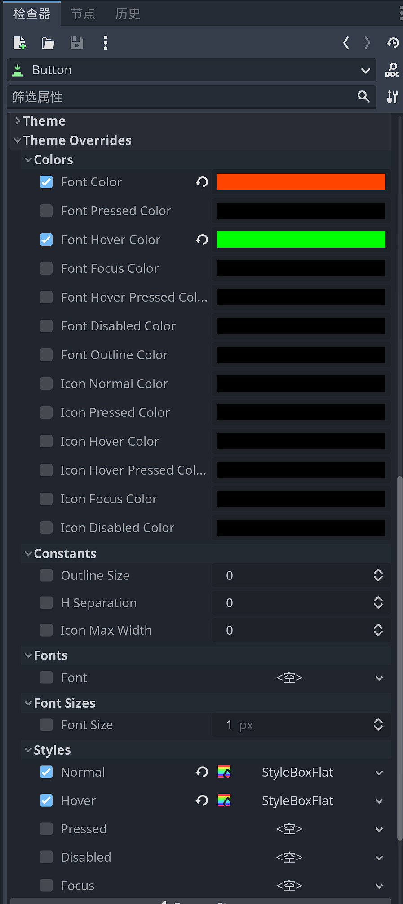
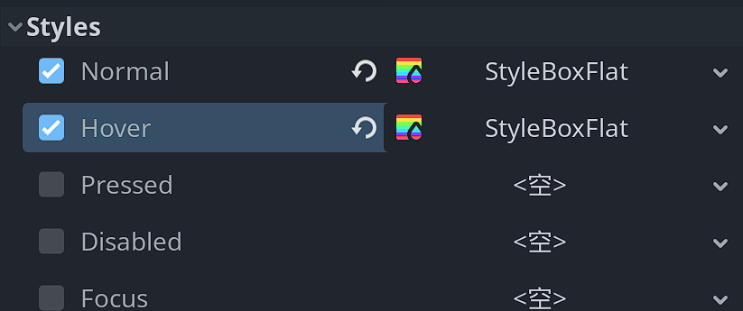
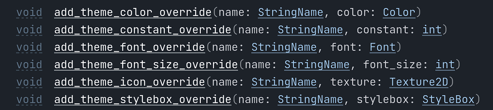
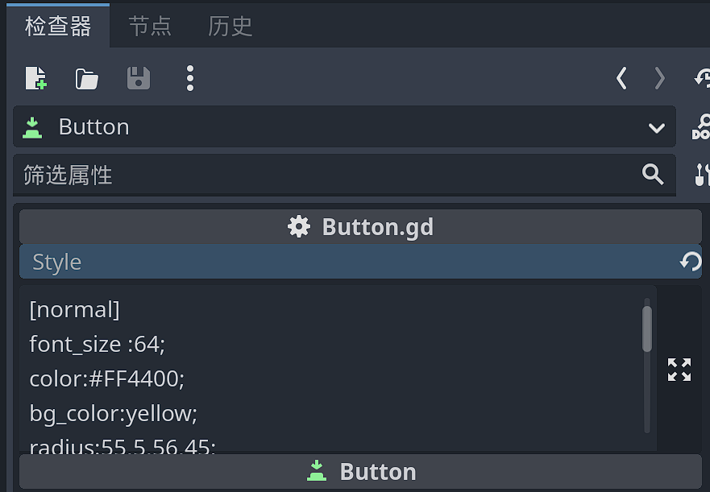

# 原理解析

下面是添加了更详细注释和只剩下核心部分的代码。你可以更清晰的看到我是如何做的。

```swift
# 样式解析
static func parse_style(ctl:Control,style_str:String):
	# 创建ConfigFile实例
	var cfg = ConfigFile.new()
	# 在解析前替换冒号和封号，使格式转为标准ConfigFile形式，从而保证被正确解析
	var err = cfg.parse(style_str.replace(":","=\"").replace(";","\""))
	if err == OK: # 解析成功
		# 遍历节和旗下的键
		for section in cfg.get_sections():
			for key in cfg.get_section_keys(section):
				var val = cfg.get_value(section,key) # 获取键的值
				# 根据键的名称分别处理
				match key:
					"color":
						# 根据节的名称更近一步进行细节处理
						match section:
							# 节名对应的是一种控件的交互或状态
							"normal":
								# 添加属性覆盖
								ctl.add_theme_color_override("font_color",Color(val))
							"hover","pressed","disabled","focus":
								ctl.add_theme_color_override("font_%s_color" % section,Color(val))
					"..."
						...
```
## 1.ConfigFile的字符串解析

首先是基于`ConfigFile`的字符串解析形式解析：`ConfigFile`类允许使用`parse()`方法解析一个字符串为配置文件。

这也是控件的Style属性可以被解析的先决条件。

实际的Style属性，为了更像网页前端使用的CSS，故而做了一些语法的变化，比如：

- 使用`:`而不是`=`号分隔键值对
- 使用`;`结尾

```
[normal]
font_size:64;
color:#FF4400;
bg_color:yellow;
radius:55,5,56,45;
skew:0.1,0;
border_width:5,2,5,2;
border_color:#444;
[disable]
color:#00FF00;
[hover]
color:#00FF00;
bg_color:#ccc;
radius:55,5,5,45;
```

上面的样式设定会在用`ConfigFile`的`parse()`方法解析前，替换冒号为等号，并删除所有的封号。

也就是转为如下形式：

```
[normal]
font_size=64
color=#FF4400
bg_color=yellow
radius=55,5,56,45
skew=0.1,0
border_width=5,2,5,2
border_color=#444
[disable]
color=00FF00
[hover]
color=00FF00
bg_color=ccc
radius=55,5,5,45
```

这基本上就是一个标准的`Config File`形式了。可以被`ConfigFile`类解析，并从中获取键对应的值。

实际上你可以看到它本质上修改的是控件的“主题覆盖”部分。通过以状态划分节，用简化和通用的属性名来设置值。



以下是详细的对照和说明

```
[normal]                == 代表了按钮的默认状态
font_size=64
color=#FF4400           -- 对应color分组下font_color属性
bg_color=yellow		    -- 对应normal样式盒的bg_color属性
radius=55,5,56,45		-- 对应normal样式盒的corner_radius_*属性  -- 设定样式盒的圆角    - (左上,右上,右下,左下)
skew=0.1,0				-- 对应normal样式盒的skew属性             -- 使样式盒产生偏斜效果
border_width=5,2,5,2	-- 对应normal样式盒的border_*属性         -- 设定样式盒的边框宽度 -（左,上,右，下）
border_color=#444		-- 对应normal样式盒的border_color属性     -- 设定样式盒的边框颜色
[disable]               == 代表了按钮的禁用状态
color=00FF00			-- 对应color分组下font_disabled_color属性
[hover]					== 代表了按钮的鼠标经过状态
color=00FF00			-- 对应color分组下font_hover_color属性
bg_color=ccc			-- 对应hover样式盒的bg_color属性
radius=55,5,5,45		-- 对应normal样式盒的corner_radius_*属性  -- 设定样式盒的圆角    - (左上,右上,右下,左下)
```

根据styles分组可知：Button至少需要实现5种状态：



## 2.控件的add_theme_*方法

Control类型提供了以下方法：



通过它们，可以快速的设定相应名称的样式覆盖属性。而不是使用类似`theme_override_colors/font_color`这样的全路径。

## 3.获取样式盒函数

由于设定style属性时，控件可能已经存在覆盖的样式盒，或者没有，因此需要一定的判断和处理。

`get_stylebox()`方法就是为此而生。

```swift
# 获取控件对应名称的样式盒
static func get_stylebox(ctl:Control,name:String) -> StyleBoxFlat:
	var stylebox:StyleBoxFlat
	# 如果已经存在覆盖的样式盒
	if ctl.has_theme_stylebox_override(name):
		stylebox = ctl.get_theme_stylebox(name)
	else:
		# 创建一个新的样式盒 - 默认为StyleBoxFlat类型
		stylebox= StyleBoxFlat.new()
		# 添加为覆盖样式盒
		ctl.add_theme_stylebox_override(name, stylebox)
	return stylebox # 返回对样式盒的引用，以用于后续操作
```

## 4.为控件添加style属性

目前为止只实现了Button控件的部分样式解析，因此以Button为例，创建一个UI场景，添加一个Button。

为Button添加如下代码：

```swift
@tool
extends Button

# 自定义导出变量style - 多行文本形式
@export_multiline var style:String = "":
	set(val): # 属性修改时
		style = val
		Sty.parse_style(self,val) # 解析样式
```

此时就可以在检视器面板看到一个style导出变量，并且是多行文本框样式。在其中填入我们的样式代码，样式就会自动解析。



## 总结

结合以上的内容和手段，就可以实现控件样式的文本化解析。
