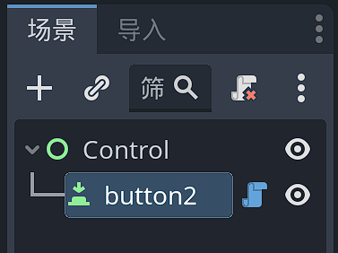
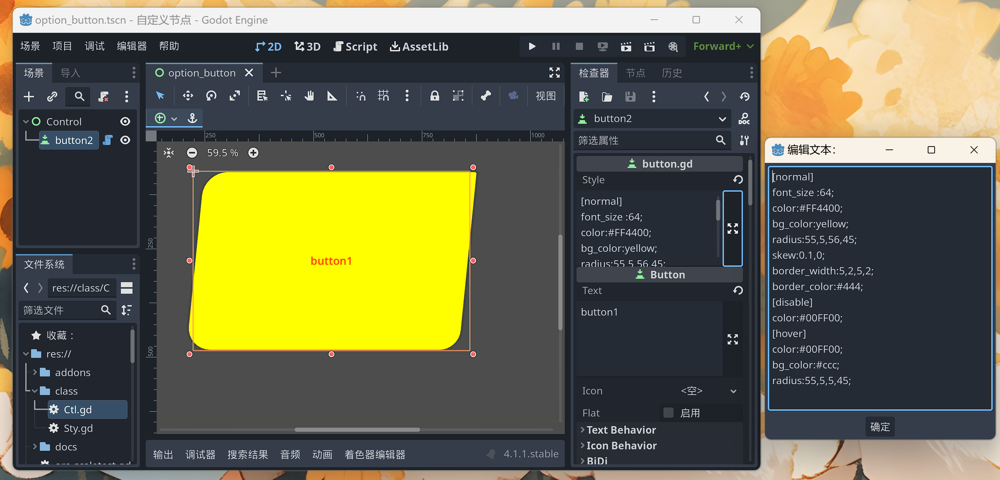

# Godot控件自定义样式解析

## 概述

Godot控件体系存在的问题之一就是样式无法用纯文本形式简洁而清晰的定义，一切都要靠主题编辑器或检视器面板那一套手动的东西。4.x提供了一些样式属性和方法，但仍然算不上简洁。

在样式定义方面，前端的CSS样式表可谓是最佳实践之一。

如果能够以类似CSS一样的纯文本形式解析和控制Godot的控件样式。那么将是一件创举。

基于这样的想法，笔者尝试建立了一个类CSS样式的书写和解析机制。让使用者可以基于一个简单的导出变量，用纯文本的方式定义控件的样式。

## 样式解析函数库

ConfigFile提供了一个名叫`parse()`的方法，可以将符合ConfigFile风格和书写规则的字符串直接解析到ConfigFile实例。进而可以使用其提供的方法便捷的遍历节、键和值。

基于此我创建了一个名为Sty的静态函数库。

下面是初期的一个效果，已经可以解析按钮多个状态下的一些简单样式。

## 实际使用

### 为普通节点添加style属性

我们创建一个UI场景，添加一个一个`Button`。



为Button添加如下代码：

```swift
@tool
extends Button

@export_multiline var style:String = "":
	set(val):
		style = val
		Sty.parse_style(self,val)
```

接着我们在检视器面板的style变量中，定义如下的样式：

```swift
[normal]
font_size :64;
color:#FF4400;
bg_color:yellow;
radius:55,5,56,45;
skew:0.1,0;
border_width:5,2,5,2;
border_color:#444;
[disable]
color:#00FF00;
[hover]
color:#00FF00;
bg_color:#ccc;
radius:55,5,5,45;
```

---

**关于语法**

因为我是以Button控件为模板进行初期的样式语法测试，所以以Button为例的话，我们可以看到一个按钮的样式其实是可以分为几个状态的：正常(normal)，禁用(disable)，鼠标经过(hover)，按下(pressed)，获得焦点(focus)。

所以我采用了状态优先，属性名称简化和重用的设计。并且采用了Godot的ConfigFile格式。将按钮的不同状态作为配置文件的section，但是为了简化书写，让其更像是CSS风格，所以采用了冒号和封号，而不是等号来设定键值对。在解析时冒号和封号会被替换。

---

然后对应的按钮样式被定义为如下图：



因为加了`@tool`关键字，所以在`normal`状态中定义的样式都会被实时的显示在编辑器中，而其他的诸如`hover`等需要在运行后查看。